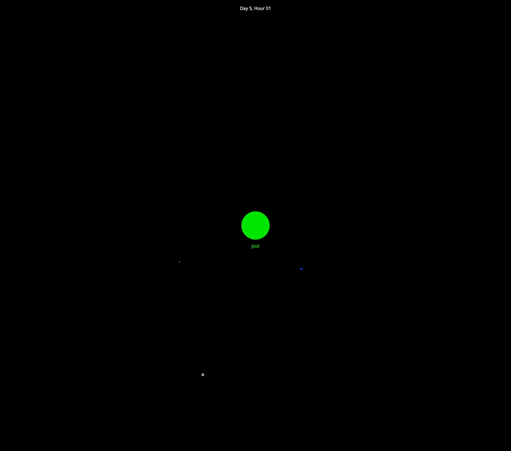

# Kerbolar

This is an n-body gravitational simulation of the [Kerbolar](https://wiki.kerbalspaceprogram.com/wiki/Kerbol) system from [Kerbal Space Program](https://www.kerbalspaceprogram.com/), written in Rust.
The [Keplerian orbit](https://en.wikipedia.org/wiki/Kepler_orbit) data used to define the trajectories of celestial bodies in the game are converted into [orbital state vectors](https://en.wikipedia.org/wiki/Orbital_state_vectors) that define the initial condition of the system, then the simulation proceeds using the [Euler method](https://en.wikipedia.org/wiki/Euler_method), applying [Newton's law of universal gravitation](https://en.wikipedia.org/wiki/Newton%27s_law_of_universal_gravitation) at each time step.
I use [Nannou](https://nannou.cc/) for 2D rendering, though the simulation actually takes place in 3D.

Interestingly, even at small time steps, the Joolian system as defined in the game is not stable;
the moon Vall, through several close encounters with the larger moons Laythe and Tylo, is ejected from Jool's sphere of influence within only a few weeks of the start of the simulation.

## Controls

* Use the mouse wheel to zoom in and out, towards or away from whichever body is currently being focused.
* Use the left and right arrow keys to cycle the focus between different celestial bodies.
* Use the up and down arrow keys to change the simulation's time step; higher time steps lead to a less accurate simulation.
* Use the `[` and `]` keys to change the number of time steps simulated per frame.
* Pressing P toggles the pause state, and H toggles highlighting of bodies which become too small to see at the current zoom level.
